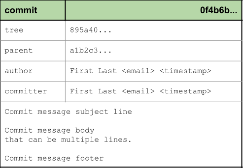
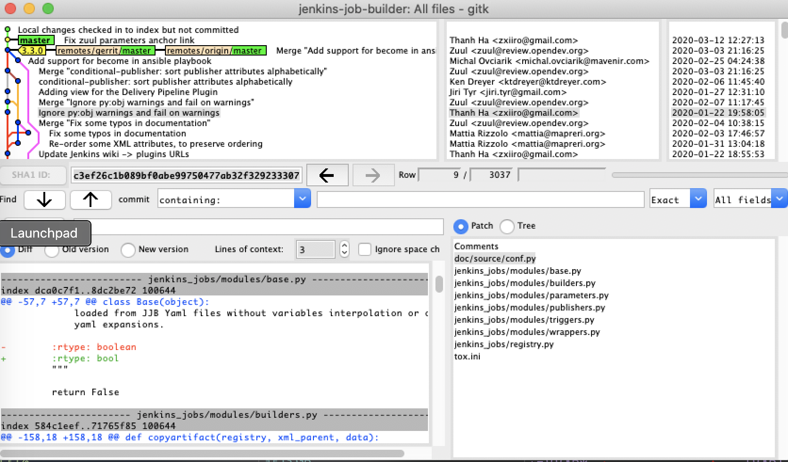
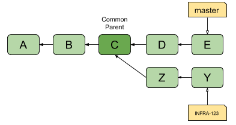

Deeper look into commits
========================

Despite being the core function of Git, folks new to Git often ignore the
importance of understanding :term:`Commit Objects <Commit object>` and how
they interact with the entire Git system.

One important overlooked feature of it is the Commit Message, often times
commits with poorly defined messages are created and submitted to Git repos
that make it difficult to later troubleshoot or sometimes automate tasks with
Git.

In this section we will take a deeper dive into Git Objects themselves as well
as explore what makes a great **Commit Message** when preparing a commit for
public review.

   Commit object

Topics:

.. contents::
    :local:
    :depth: 1

Writing a great commit message
------------------------------

Similar to email, a commit message has a subject line and a body which
is separated by a blank line. Do not write your entire commit message in the
subject line.

.. code-block:: none

    Subject line in 50 chars or less

    Following a blank line after the subject line is the commit message
    body, containing a more detailed explaination of the change.
    This should be word-wrapped at 72 characters.

    The body can consist of as many lines as necessary to fully
    explain in detail why the change is necessary. You should
    explain the problem that this commit is solving and focus on
    why this change is necessary rather than explaining the "how"
    (the reviewer can review the code for that detail).

    Include any side effects and consequences of the change.

    Many CLI based tools such as `git log`, `git shortlog`,
    `git rebase`, are significantly more useful when the commit
    messages follow these best practices.

    Finally the last "block" (a section without further blank spaces
    following it) is for metadata such as sign-offs, references, and
    issue numbers.

    Change-Id: I75d8113941e4e455ec34fab23d347816c2ef699b
    Issue: #123
    See-also: #456
    Co-authored-by: First Last <email>
    Signed-off-by: First Last <email>

The subject line
^^^^^^^^^^^^^^^^

The subject line should be short and to the point, providing enough detail
for the reader to immediately have a decent idea about what the commit is
about.

From the ``git commit`` manpage:

    Though not required, it’s a good idea to begin the commit message with a
    single short (less than 50 character) line summarizing the change,
    followed by a blank line and then a more thorough description. The text up
    to the first blank line in a commit message is treated as the commit
    title, and that title is used throughout Git. For example,
    Git-format-patch(1) turns a commit into email, and it uses the title on
    the Subject line and the rest of the commit in the body.

Best practices:

* Keep the subject line short (50 characters)
* The first letter of the subject line should be capitalized
* The subject line should not end with any punctuation
* The subject line should be written in imperative mood
* Immediately following subject line is a blank line

Good examples:

- Allow pyyaml >= 5
- Bump version to 2.0.0-SNAPSHOT
- Fix double inderection of name templates
- Add Private and WIP change support for gerrit

Bad examples:

- Add support for noSquash (no-squash) in jms-messaging trigger
  (**Subject line over 50 char**)
- Fixes delete-all command when no option is provided (**Not imperative mood**)
- Adding view for the Delivery Pipeline Plugin (**Not imperative mood**)
- test non-default value of attach-build-log (**Uncapitalized first letter**)
- Remove deprecated 'extended-choice' property. (**Ends in period**)
- Fix docs build issue (**Too vague**)

The commit body
^^^^^^^^^^^^^^^

Following a blank line after the subject line, the commit body is where you
can explain your change in full details.

Best practices:

* Keep lines under 72 characters
* Explain what and why instead of how

Git as well many tools that parse Git commits do not automatically wrap text
so you must manually do this yourself. Keeping the limit to 72 characters is
good practice to allow for Git to do indentation and still be under 80
characters total.

Put yourself in the shoes of the reviewer of the change. If someone proposed
this change to you, what information would you like to know about it before
you will approve the change?

Reviewers can look at the diff to see what exactly was changed so focus on
telling the reviewer why they should accept your change. You are essentially
writing a project proposal here so provide as much detail as possible.

If you are fixing code or a test, include details on how to reproduce the
problem so that the reviewer doesn't have to reach out to you for further
details on how to retest.

Good example A:

.. code-block:: none

    Fix the yaml load warning

    In the new version of PyYAML the API changed to be more explicit. Now
    the default value for the Loader is None, see:

    https://github.com/yaml/pyyaml/blob/5.1/lib3/yaml/__init__.py#L103

    The load is unsafe. It's better to use safe_load function.

    Change-Id: Ia1cd16f2ff970ca220a266c99b6554dd4254ebd9

Good example B:

.. code-block:: none

    Add 'secret-token' parameter to gitlab trigger

    This adds support for the job specific secret token in the
    gitlab build trigger.

    This feature was added to the "Gitlab Plugin" with version 1.4.1
    (released Sep 24, 2016).
    Excerpt from the changelog:
     "Add possiblity to configure secret tokens per job to allow
     only web hooks with the correct token to trigger builds."

    Change-Id: Id1ede4a6a51a231f60a39bfaefbadd8f849076e4

Commit message footer
^^^^^^^^^^^^^^^^^^^^^

The final block of a commit message is a commit message footer. Similar to
email it's where you sign off on your message as well as include other useful
metadata. Typically for references to issues or links to pages for additional
information.

Example:

.. code-block:: none

    Issue: ABC-123
    Change-Id: Iaa40ef0377409e08e6efd41aa967249f9d3c4xyz
    Co-authored-by: Bob <bob@example.com>
    Signed-off-by: Tim <tim@example.com>

**Signed-off-by**

You may have noticed in many open source projects folks leave a
``Signed-off-by: Firstname Lastname <someone@example.com>``.

This can be added via the ``git commit -s`` command, it's a convenience
parameter to automatically type it in for you but you can also type it in by
hand when writing your commit message.

Signed-off-by doesn't really mean much in most projects but some open source
projects use it as a way of indicating that you have signed off on an
official document such as a **Contributor License Agreement (CLA)** or a
**Developer Certificate of Origin**.

Reference: https://developercertificate.org/

.. code-block:: none
    :caption: Developer Certificate of Origin

    Developer Certificate of Origin
    Version 1.1

    Copyright (C) 2004, 2006 The Linux Foundation and its contributors.
    1 Letterman Drive
    Suite D4700
    San Francisco, CA, 94129

    Everyone is permitted to copy and distribute verbatim copies of this
    license document, but changing it is not allowed.

    Developer's Certificate of Origin 1.1

    By making a contribution to this project, I certify that:

    (a) The contribution was created in whole or in part by me and I
        have the right to submit it under the open source license
        indicated in the file; or

    (b) The contribution is based upon previous work that, to the best
        of my knowledge, is covered under an appropriate open source
        license and I have the right under that license to submit that
        work with modifications, whether created in whole or in part
        by me, under the same open source license (unless I am
        permitted to submit under a different license), as indicated
        in the file; or

    (c) The contribution was provided directly to me by some other
        person who certified (a), (b) or (c) and I have not modified
        it.

    (d) I understand and agree that this project and the contribution
        are public and that a record of the contribution (including all
        personal information I submit with it, including my sign-off) is
        maintained indefinitely and may be redistributed consistent with
        this project or the open source license(s) involved.

Be careful about the sign-off rules on the projects you are contributing to
and make sure you understand what the sign-off means in case the project you
are contributing to has a document similar to this.

Final tips on commit messages
^^^^^^^^^^^^^^^^^^^^^^^^^^^^^

* **Resist the urge to use** ``git commit -m``

  While it may seem handy at first, it promotes a habit of writing
  unthoughtful commit messages. By editing your commit message in a full
  editor you will spend more time thinking about your commit message.

* **Spend time reviewing code yourself**

  If you are actively participating in a project, spend some time reviewing
  code on that project even if you are not a maintainer or committer on the
  project. This is the best way for you to quickly learn the best practices of
  not only the project but also what we discussed here as it is easier to
  understand the hardships of a code reviewer if you are one yourself.

Poor man's automated release notes
----------------------------------

To prove a point that well defined commit messages can be useful. One way to
take advantage of a repo that follows the best practices is to automate
generation of release notes with commit messages.

For example the Jenkins Job Builder (JJB) project generates release notes this
way. You can reproduce one by following these steps:

.. code-block:: bash

    git clone https://review.opendev.org/jjb/jenkins-job-builder
    git log --no-merges --pretty=format:"%h %<(20) %an %s" 2.9.0..3.0.0

You should get something similar to this:

.. code-block:: none
    :emphasize-lines: 12, 24, 25

    1d48093f  Jelle van der Waa    Fix typo in bitbucket_scm discover-branch parameter
    c907f770  Aviel Yosef          Adding support for the cachet gating plugin
    77549954  Sorin Sbarnea        Correct dependencies on tox linters
    a9e12ed4  Philip Roche         Add support for rendering jinja template as yaml
    073e7bb5  Ivan Fernandez Calvo Add support for GH Custom Notification Context
    dfbcbb25  Johann David         Add support for 'Micro Focus Application Automation Tools'
    ddc5ee77  Patrick Paul         Include support for jacoco source inclusion pattern
    a90f084f  Chris Koehnke        Add 'skip-initial-build' to project multibranch
    9b0fd46e  OpenDev Sysadmins    OpenDev Migration Patch
    a4e5be1e  Evgeni Golov         fix job-template call in include-raw-escaped fixtures
    71f1c89b  Sorin Sbarnea        remove support of old plugin config format
    2bff652b  Andrey Kostrov       Add `Specs support` for `artifactory_generic` Add support of Artifactory Specs https://www.jfrog.com/confluence/display/RTF/Using+File+Specs
    c5013b61  Thanh Ha             Ignore view update if not specified
    c3539a31  Thanh Ha             Refactor jobfilters to separate file
    e6398cf3  Vishal Bhoj          Set reference repo under clone options
    fc7864ab  Gleb Samsonov        adding variable bindings option to extended parameters
    062b759e  Norbert Grünwald     Add 'publishers-from' to the publishers module
    55de2146  Areum Cho            Add support for Packer plugin
    23079af7  Thomas Bechtold      Allow pyyaml >= 5
    43f002c6  Alexander Evseev     Property to disable job resume on Jenkins restart
    ced1495a  Ian Wienand          Replace openstack.org git:// URLs with https://
    87af31a3  Ivan Remizov         Fix loader overwriting
    b67c0bc7  Kyr Shatskyy         Add support for 'RocketChat Notifier Plugin'
    0f2c43fc  Thiago Miotto        Adds match-script and groovy-sandbox to Lockable Resources Plugin properties
    8cb88e03  Brian Kruger         [jenkins-job-builder] - Add support for Generic Webhook Trigger
    a2ad875f  Ladislav Thon        add the "honorRefspec" option to the Git SCM
    c59b5a52  Daniel Watkins       Fix new flake8 failures
    ff338dc9  amit lin             Adds github scm multibranch regex branch filter
    bc55a673  Mykola Nikishov      Do not ignore global-settings-type in Maven module
    32802fdd  qingszhao            Update mailinglist address
    78e4f00c  Li-Wen Hsu           Add retry support to plugins depend on Publish Over X
    774dd59f  Dane Foster          adds vault unlocking parameter to ansible builder
    cf152d67  sbussetti            Adds named branches to property strategy support
    2914c7a7  tanhengyeow          cucumber-reports: Add support for new options
    02e85408  Thanh Ha             Fix default '0' being ignored
    039c860d  tanhengyeow          Add support for "Build / Publish Docker Image"

This has a many of the key points we are interested in a simple release notes
package:

1. Summary of what changed since last release
2. Credit to the author of the change
3. A reference that can be used to get more details if necessary

Troubleshooting and debugging
-----------------------------

Commit messages are also great for quickly troubleshooting an issue if some
change broke our project in an unexpected way. If commit messages are well
formed, developers can review the git log to quickly identify which changes
may be related to the unexpected issue and narrow down the problem much more
quickly.

Referring back to the JJB project again, there was a case where a hotfix
release had to be pushed out shortly after a major release. If we take a look
at the difference between versions 2.2.0 to 2.2.1 we can see that the hotfix
release reverted a particular commit:

.. code-block:: bash

    git log --no-merges --pretty=format:"%h %<(20) %an %s" 2.2.0..2.2.1

    c33dbaaa  Thanh Ha             Revert "Allow dashes in variable key names"

After some users started deploying version 2.2.0 we quickly discovered that
folks using certain characters in their variable names. The original commit
``b92336aa  Darragh Bailey       Allow dashes in variable key names`` was
descriptive enough that allowed us to narrow down to this commit to identify
the issue and revert and release a hotfix.

Tools for commit review
-----------------------

.. contents::
    :local:
    :depth: 1

git status
^^^^^^^^^^

The ``git status`` command is a useful command for showing the current state
of your Git directory. Showing the relation between your :term:`Worktree` and
the Local Repository.

**git status: brand new repo**

.. code-block:: none

    On branch master

    No commits yet

    nothing to commit (create/copy files and use "git add" to track)

**git status: clean worktree**

.. code-block:: none

    On branch master
    nothing to commit, working tree clean

**git status: untracked file**

.. code-block:: none

    On branch master
    Untracked files:
      (use "git add <file>..." to include in what will be committed)

        abc

    nothing added to commit but untracked files present (use "git add" to track)

**git status: modified file**

.. code-block:: none

    On branch master
    Changes not staged for commit:
      (use "git add <file>..." to update what will be committed)
      (use "git checkout -- <file>..." to discard changes in working directory)

        modified:   test

    no changes added to commit (use "git add" and/or "git commit -a")

**git status: staged file**

.. code-block:: none

    On branch master
    Changes to be committed:
      (use "git reset HEAD <file>..." to unstage)

        new file:   abc

git log
^^^^^^^

The ``git log`` command is useful for inspecting the branch history.
This command unfortunately is only as useful as participants on the project
make it. See :ref:`commit-objects:Deeper look into commits` for best
practices on managing your commit message.

Check the log of the projects you work on often and try to see if you can
understand the progress of the project from the log. Use the following log
commands and explore the differences:

* git log
* git shortlog
* git log 1.0.0..2.0.0

Many Git commands support passing a commit range to tell Git to show you what
changes are in the 2nd reference point that's not in the 1st reference point.
What Git is doing in this case is taking the 2 commits as a starting point,
then walk through the commit history looking for a common ancestor or parent
commit. Then it uses the commit parent as the starting point of history and
returning the results from the parent commit until the 2nd reference point.

Try reversing the 2 reference points and see how the log changes.

git diff
^^^^^^^^

The ``git diff`` command is useful for checking out what changed between 2
commit points. Try the following:

* git diff
* git diff HEAD~1
* git diff origin/master
* git diff BranchA BranchB

gitk
^^^^

This is the default Git GUI that comes with standard Git. It's a powerful
GUI based viewer to allow you to see the state of the local Git repo. It's
a combination of ``git log`` and ``git diff`` put together into a single
easy to navigate viewer.

   gitk - Graphical history viewer

History of specific path
^^^^^^^^^^^^^^^^^^^^^^^^

Many Git commands support the ability to look up the history of specific
paths. Whether it be a directory or individual files.

* gitk -- README
* gitk -- src/
* git diff -- README
* git log -- src/

The ``--`` is necessary if you are looking for details on a path that was
removed from current commits.

Commit ranges
^^^^^^^^^^^^^

Many Git commands also support the ability to pass ranges using ``from..to``
notation. This is useful if you want to know what's different between 2
branches.

**Double dot notation** The double dot notation tells Git to show you only
commits that are in the 2nd parameter that is not common to both.

**Triple dot notation** The triple dot notation tells Git to show you commits
from both parameters that are not common.

   Git history with work branch

Examples:

* gitk 1.0..2.0
* git log --no-merges --pretty=format:"%h %<(20) %an %s" 2.2.0..2.2.1

Demo: Committing and amending
-----------------------------

First let's create a file that we can use to commit and amend.

.. code-block:: bash

    git status

    echo "To contribute to this project simply open a PR." > CONTRIBUTING
    git status

    git add CONTRIBUTING
    git status

    git commit

.. note::

    Avoid using ``git commit -m 'Message'``. While it may seem handy it should
    be considered a bad habit as it promotes giving little thought to the
    message. You should always edit your commit message with a proper editor.
    This gives you the time to think about your message as well as gives you
    time to enter relevant footer information to create a more complete
    message.

**Amending the commit**

.. code-block:: bash

    git status

    echo "If you need help, reach out to the #help channel." >> CONTRIBUTING
    git status

    git add CONTRIBUTING
    git status

    git commit --amend

**Signing off on your commit**

.. code-block:: bash

    git commit --amend -s

Alternatively you can manually enter the Sign-off-by line with your editor.

Commit Mesages: Key Takeaways
-----------------------------

* Make your commit messages meaningful
* Commit messages can be used to quickly diagnose issues or even automation
