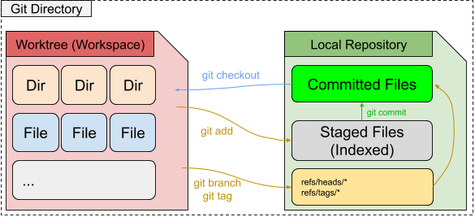
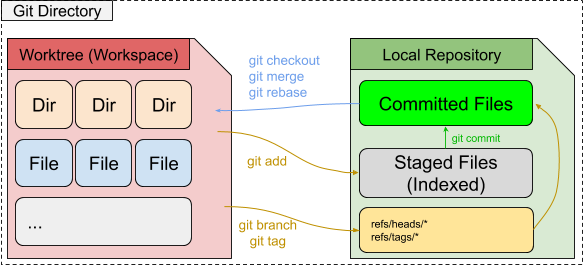

Development lifecycle: Branches and Tags
========================================

In this section we will discuss commands useful for everyday Git use.

Topics:

.. contents::
    :local:
    :depth: 2

Worktree management
-------------------

.gitignore
^^^^^^^^^^

The ``.gitignore`` file is a special file that can be checked into your Git
repo to tell the Git client to ignore **tracking** certain files.

As mentioned in the :ref:`building-blocks:Local Repository` section there is
also a ``.git/info/excludes`` file which can also be used to ignore files
however this file is not shared in Git so any changes here will only affect
your local work. Typically folks will use ``.gitignore`` as it can be shared
with the team.

One point of confusion for many folks with ``.gitignore`` is the idea of
**tracking** files. This means Git will only ignore the file if it is not yet
tracked (as in checked into Git). So if you already did ``git add file`` to a
specific file, then that file is already tracked in the Git database so the
file won't be ignored.

Let's try a few use cases.

**Case 1: Add a .gitignore**

.. code-block:: bash

    git status
    echo "password.txt" > .gitignore

    git status
    echo "Password" > password.txt

    git status
    git add .gitignore

    git status
    git commit

    git status

Notice that even though we did not commit ``.gitignore`` yet, the fact that
the file exists is enough for the Git client to read the file and ignore
any files that match the pattern.

**Case 2: Force tracking on an ignored file**

.. code-block:: bash

    git status
    git add -f password.txt

    git status
    git commit

    git status
    echo "Password 2" >> password.txt

    git status
    git diff

In this case we see that despite the ``.gitignore`` in place we can track a
file with force. Once tracked however we can see that Git will not ignore
subsequent ignores.

git clean
^^^^^^^^^

The ``git clean`` command is useful to quickly manage your local Worktree.
It provides a quick way to remove temporary files from the repo such as
leftover build artifacts, temporary test files, or even cleanup tool
directories.

* git clean
* git clean -fd
* git clean -fdx

Working with Branches and Tags
------------------------------

   Workspace: Branches and Tags

Branches and Tags in Git are essentially bookmarks. It's an easy to remember
reference to a commit. The commit itself has a Commit SHA as mentioned earlier
which is the real address of the commit. Without Branches and Tags we would
have to memorize all these SHAs to find commits we are looking for.

When working with Branches and Tags there are 3 important Git Local Repository
locations to understand.

1. ``.git/HEAD`` or **HEAD** is the reference point to the current commit
   reference point in the worktree. Often this just points to a branch or tag
   but if you checked out a specific Commit SHA it will point to the SHA in
   what's called a **detached HEAD** mode.

   **HEAD** will move to a new commit every time ``git commit`` or
   ``git checkout`` is issued.

2. ``.git/refs/heads/*`` or **branches** is where all the branches are stored.
   Every file here is a branch, and the contents of the file just points to
   the Commit SHA of the commit the branch is currently at.

   The **branch** reference point will move every time ``git commit`` is
   issued.

3. ``.git/refs/tags/*`` or **tags** is where all the tags are stored and same
   as branches the contents point to a specific Commit SHA of the tagged
   reference point. The difference however is that tags are immutable and do
   not move. They will always point to the same commit every time.

   The **tag** reference point is not expected to ever move.

Branches and Tags from this perspective are essentially the same thing. The
are bookmarks pointing to specific Commit SHAs for easy look up. The
difference however is tags are immutable meaning they do not ever change so
you can have a guarentee that they will always point to the same commit
object.

For this reason the most common use case for tags is to reference a release so
that folks can refer back to the exact source code that built a particular
release for historical reasons. Another less common use case though for tags
is to reference specific interesting points in time. Maybe there's an
interesting lessons learned or interesting commit that might be interesting
to reference back to for historical reasons, we can use a tag to bookmark
those commits.

Branches on the otherhand are constantly in flow. Every time you do a
``git commit`` while on a specific branch Git will automatically update
the branch reference point to the new commit you just made.

git-checkout
^^^^^^^^^^^^

This is the main command we can use to fetch files from the Git Local
Repository into our Worktree.

**git checkout**

.. code-block:: bash

    git checkout master
    cat .git/HEAD
    cat .git/refs/heads/master

    git checkout SHA
    cat .git/HEAD

    # Create a new commit
    git add file
    git commit
    cat .git/HEAD

    # Create a new commit on a branch
    git checkout master
    cat .git/HEAD
    cat .git/refs/heads/master
    git add file
    git commit
    cat .git/HEAD
    cat .git/refs/heads/master

**git checkout & create branch**

.. code-block:: bash

    git checkout -b new-branch master
    cat .git/HEAD
    cat .git/refs/heads/new-branch

git-branch
^^^^^^^^^^

.. figure:: img/git-branch-basic.png
    :alt: Branching

    Branching

.. code-block:: bash

    git branch new-branch master
    cat .git/HEAD
    cat .git/refs/heads/new-branch

**Tracking branches** are useful to have your branch track another branch so
that when you do ``git status`` it will tell you how many commits difference
between the 2 branches. This is typically useful when working with remotes
which we will discuss later however can be used to track any local branch as
well.

.. code-block:: bash

    git status
    git branch -u master new-branch
    git status

This tells Git to make **new-branch** track the **master** branch for changes.

.. code-block:: bash

    git status
    git checkout new-branch
    git status

    git add file
    git commit
    git status

    git rebase -i master
    git status

    git checkout master
    git add file
    git commit
    git checkout new-branch
    git status

We can see how the tracking branch affects the result of ``git status``.

git-tag
^^^^^^^

Similar to branch we can create a tag easily and quickly with the ``git tag``
command.

**Lightweight tag**

.. code-block:: bash

    git tag v1.0.0

This creates a lightweight tag that is a simple reference to a specific
``commit`` or ``object``. Yes, you do not need to tag a commit you can also
tag Blobs, Trees, etc...

.. code-block:: bash

    git tag some-object SHA
    git cat-file -p some-object

Which can be useful if you want a quick way to reference some object in the
future.

**Annotated tag**

This creates a tag that can have additional information attached to it.
Similar to a commit message. This might be useful if there are detailed
information you wish to add to the tag such as upgrade procedures or release
notes which you might want to archive in a git tag.

Merging code
------------

   Workspace: Merge & Rebase

git-merge
^^^^^^^^^

git-rebase
^^^^^^^^^^