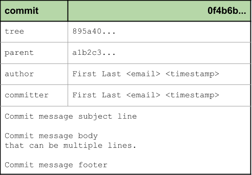

Development lifecycle: Branches and Tags
========================================

In this section we will discuss commands useful for everyday Git use.

Topics:

* Viewing commits

  * git status
  * git log
  * git diff
  * gitk

* Worktree management

  * .gitignore
  * git clean

* Working with Branches and Tags

  * git branch
  * git checkout
  * git tag

Worktree management
-------------------

.gitignore
^^^^^^^^^^

The ``.gitignore`` file is a special file that can be checked into your Git
repo to tell the Git client to ignore **tracking** certain files.

As mentioned in the :ref:`building-blocks:Local Repository` section there is
also a ``.git/info/excludes`` file which can also be used to ignore files
however this file is not shared in Git so any changes here will only affect
your local work. Typically folks will use ``.gitignore`` as it can be shared
with the team.

One point of confusion for many folks with ``.gitignore`` is the idea of
**tracking** files. This means Git will only ignore the file if it is not yet
tracked (as in checked into Git). So if you already did ``git add file`` to a
specific file, then that file is already tracked in the Git database so the
file won't be ignored.

Let's try a few use cases.

**Case 1: Add a .gitignore**

.. code-block:: bash

    git status
    echo "password.txt" > .gitignore

    git status
    echo "Password" > password.txt

    git status
    git add .gitignore

    git status
    git commit

    git status

Notice that even though we did not commit ``.gitignore`` yet, the fact that
the file exists is enough for the Git client to read the file and ignore
any files that match the pattern.

**Case 2: Force tracking on an ignored file**

.. code-block:: bash

    git status
    git add -f password.txt

    git status
    git commit

    git status
    echo "Password 2" >> password.txt

    git status
    git diff

In this case we see that despite the ``.gitignore`` in place we can track a
file with force. Once tracked however we can see that Git will not ignore
subsequent ignores.

git clean
^^^^^^^^^

The ``git clean`` command is useful to quickly manage your local Worktree.
It provides a quick way to remove temporary files from the repo such as
leftover build artifacts, temporary test files, or even cleanup tool
directories.

* git clean
* git clean -fd
* git clean -fdx

Manipulating Branches:

.git/HEAD
.git/refs/*

Branches don't really exist in Git. They are a convenience for humans as a way
to point to commit objects that would otherwise be impossible for a human to
track.

Working with Branches and Tags
------------------------------

   Commit object
