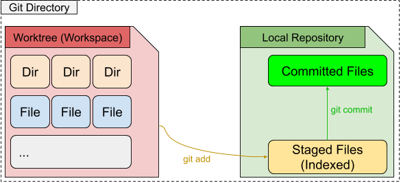
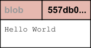
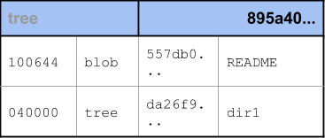
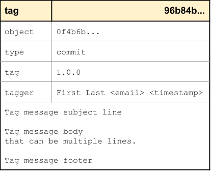
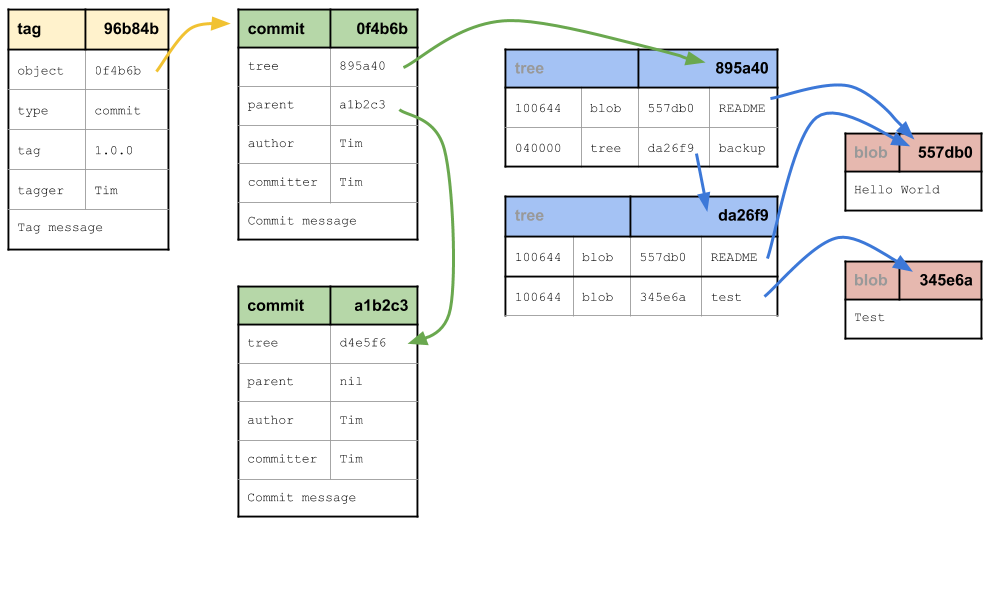

#########################
Git, a follow along guide
#########################

Git is a distributed revision control system. At it's most basic level it
tracks the historical changes in contents of files over time.

It's distributed nature means everyone working on a project has their own
separate offline copy of all of the code allowing folks to work on the same
project in parallel.

Git is probably the single most important skill for anyone working in
technology today on any kind of collaborative project. If you are struggling
to use Git you will be limited in your ability to collaborate with others.

Throughout the course of this Guide, I hope to pass on some knowledge that
will help you more effectively use Git and hopefully be interesting to both
newbies as well as veterans of Git.

.. contents:: Table of Contents
	:local:
	:depth: 2

The building blocks of Git
==========================

Topics:

* The Git directory

  * Local Repository
  * Worktree (Working Directory)
  * Staging Area (Index)

* The Git Object Model

  * Commit
  * Trees
  * Blobs
  * Tags

* Demo: Working with the Git directory

  * git init
  * git add
  * git commit
  * git checkout

* Demo: Working with multiple Worktrees
* Git Fundamentals: Key Takeaways

Overview of the Git directory
-----------------------------

   Worktree | Staging Area | Local Repository

A directory containing a Git repo can contains 3 important parts:

1. Worktree (Working directory)
2. Staging Area
3. Local Repository

It is really difficult for a new user to effectively use Git until they
understand the difference between these 3 components.

Local Repository
^^^^^^^^^^^^^^^^

The ``.git`` directory contains the Git configuration and database. When
you're talking about a Git repository, this is the repository itself.

Contents:

.. code-block:: none
    :caption: ls .git

    HEAD
    config
    description
    hooks
    info
    objects
    refs

:HEAD: Contains the active checkout of your current workspace.

:config: Contains your local git configuration.

:description: Only locally significant and allows you to give your Git repo a
    name. Typically not used by users, it's mostly for server use.

:hooks: Contains scripts that can be run automatically upon certain git
    actions. Commonly ``pre-commit`` is used for things like automated linting
    and testing client-side before pushing to a remote repository for CI.

:info: Contains an ``excludes`` file which is similar to ``.gitignore``
    except it is unversioned. Useful if you want to ignore things that are only
    significant to you and no one else (such as maybe you use a different IDE
    then everyone else and don't want to pollute .gitignore with your snowflake
    environmnet). Otherwise it's better to use ``.gitignore`` in most cases.

:objects: Contains the Git **object database** itself. It is a key-value store
    and every single file you check into git exists here. This is where git
    pulls the files from when you do a ``git checkout``. Every file is a SHA
    hash.

:refs: Contains all of your references, you might know them as branches,
    tags, commits... They are essentially a bunch of SHA hashes.

Worktree (Working directory)
^^^^^^^^^^^^^^^^^^^^^^^^^^^^

The worktree or working directory is where all your untracked files and work
in progress files are. When you do a ``git checkout`` you are telling Git to
copy files from the Git repository to this working area so that you can work
on them. The files are checked out in the state (or snapshot) at the reference
point you pass to the Git command.

For example ``git checkout master`` tells Git to fetch all the files from the
**master** revision and make sure the worktree's copy of all the files are
up to date with what's in the branch.

Staging Area (Index)
^^^^^^^^^^^^^^^^^^^^

The Staging area or Index is the area between your **Local Repository** and
your **Worktree**. You use this area to build up a set of changes that you
want to commit together.

The Git Object Model
--------------------

The SHA
^^^^^^^

Before we can get to the objects, it is important to understand that every Git
object is represented as a SHA1 hash in the Git database.

Everything in Git is represented by a 40 character SHA1 hash that looks
something like this ``557db03de997c86a4a028e1ebd3a1ceb225be238`` (This is
'Hello World'). This is the object name (or key in a key-value store) that Git
will use to store your contents into the :term:`Object database`.

Since SHA1 hashes are always computed exactly the same on every system, this
guarentees that the same contents are always stored with the same name in the
database and duplicate files are never stored in a Git repo.

Blob object
^^^^^^^^^^^

   Blob object

A Blob object contains the complete contents of a file.

As mentioned previously, all Git objects are stored via SHA1 hash so 2 files
with the identical contents gets stored in the :term:`Object database` as the
same exact same Blob object so there can be no duplicate files.

Another thing you may notice as we go through this guide is that Git always
stores the complete contents of files into Blobs, but when you look at a Git
commit using ``git diff`` or any tools to show the commit you will see what
changed in the file instead. What Git's doing in the background is comparing
any Blob objects that changed in a commit with the previous Blob object that
it replaced.

Tree object
^^^^^^^^^^^

   Tree object

A Tree object contains the complete contents of a directory.

It can contain additonal Tree objects and Blob objects. If you follow a tree
all the way down the final tree will only contain Blob objects, this is why
you cannot store just an empty directory in Git.

In other words, a Tree does not just contain the files that changed but
actually contains a list of all the files that currently exist at that
particular point in time.

Commit object
^^^^^^^^^^^^^

.. figure:: img/git-object-commit.png
   :alt: Commit object

   Commit object

A Commit object represents a particular point in time in the Git timeline.
It contains a tree, parent, author, committer, and commit message.

This is the object folks generally interact with the most in Git. You can
think of it as kind of an email. If you can imagine:

* The Tree is your attachments
* The commit message is your Subject line as well as email Body
* The rest of the info is metadata to describe where the commit came from

.. note::

    While the **author** and **committer** timestamps iare generated the first
    time a commit is created. The **committer** timestamp is updated every
    time ``git commit --amend`` is run.
    This is part of the reason why the commit SHA changes on ever amend.

Tag object
^^^^^^^^^^

   Tag object

A Tag object contains supporting metadata and reference to a
:term:`Commit object`.

Tags are typically used for for things like releases to provide a pointer back
to the original codebase that produced a release. It can also be used to share
interesting points in time in a codebase.

.. note::

    You may have noticed that branches are not a basic building block of Git.
    We'll explore this further later on.

Git Objects Full Example
^^^^^^^^^^^^^^^^^^^^^^^^

   Git Objects Full Example

From here we can see how all the 4 Git Object types interact with each other:

* A Tag references a particular commit
* A Commit references both a parent commit and a Tree
* A Tree can reference another Tree as well as a Blob
* 2 files can also reference the same Blob

Demo: Working with the Git Directory
------------------------------------

Before we start there are a few low level commands we'll be using throughout
this guide to explore the Git database. You do not need to remember these
commands as they are not typically used in everyday Git use but are
useful for exploring the Git database.

.. code-block:: bash

    git cat-file -t <hash>
    git cat-file -p <hash>
    echo 'Hello World' | git hash-object
    git hash-object /path/to/file

git init
^^^^^^^^

A new git repo can be initialized with the ``git init`` command.

Example:

.. code-block:: bash

    mkdir demo
    cd demo
    git init
    ls -la

It will create a single directory in the repo named ``.git`` containing the
**Local Repository** and an empty **Worktree**. The contents of a fresh
``.git`` directory is as follows:

.. code-block:: none
    :caption: find .git
    :name: find-dot-git
    :emphasize-lines: 2-3, 6, 22-24

    .git
    .git/config
    .git/objects
    .git/objects/pack
    .git/objects/info
    .git/HEAD
    .git/info
    .git/info/exclude
    .git/description
    .git/hooks
    .git/hooks/commit-msg.sample
    .git/hooks/pre-rebase.sample
    .git/hooks/pre-commit.sample
    .git/hooks/applypatch-msg.sample
    .git/hooks/fsmonitor-watchman.sample
    .git/hooks/pre-receive.sample
    .git/hooks/prepare-commit-msg.sample
    .git/hooks/post-update.sample
    .git/hooks/pre-applypatch.sample
    .git/hooks/pre-push.sample
    .git/hooks/update.sample
    .git/refs
    .git/refs/heads
    .git/refs/tags

Throughout this guide we will be monitoriing changes to the highlighted parts
of the repo to see how commands affect changes to the **Local Repository**.

.. code-block:: bash

    cat .git/config
    cat .git/HEAD
    find .git/objects
    find .git/refs/heads
    find .git/refs/tags

The only file so far is ``.git/config`` which isn't too interesting just yet
and ``.git/HEAD`` contains a reference to ``refs/heads/master`` which does
not yet exist.

git add
^^^^^^^

The ``git add`` command is used to stage files for committing into the Git
database. The area where files are staged is referred to as the **Git Index**
(or Staging Area). The easiest way to look at the **Git Index** is to use
the ``git status`` command.

.. code-block:: bash
    :caption: Demo: git add

    git status
    touch README

    git status
    git add README

    git status
    find .git/objects

    echo 'Hello World' | git hash-object --stdin
    echo 'Hello World' > README

    git status
    git diff
    git add README

    git status
    find .git/objects

    git cat-file -p 557d

With the understanding that ``git add`` is used to stage commits. We should
try to be precise in our use of the ``git add`` command. Many newbies to Git
tend to use ``git add .`` which effectively means please stage everything in
my current directory and down. Often newbies get confused when they
unintentionally pull in changes that they did not make. Instead you should
always use ``git add /path/to/file`` and select explicitly which files you
intend to commit rather than committing everything.

The commands ``git status`` and ``git diff`` can be used to review file
changes before ``git add /path/to/file`` to stage the commit so that we can
be precise in our staging.

In a more advanced example ``git add -p /path/to/file`` can be used to select
specific changes inside of a single file for staging.

.. code-block:: bash
    :caption: Demo: git add -p

    git status
    vi README  # Prepend a header and append a footer.

    git status
    git diff
    git add -p README

    # Split, and stage only the header.

    git status
    git diff
    find .git/objects
    git cat-file <SHA>

git commit
^^^^^^^^^^

The ``git commit`` command is used to checkin your work to your
**Local Repository**. This is probably the most important command in Git and
is one of the main commands of Git.

If your work is not committed, it effectively does not exist. One way to think
of committing is to think of it as **saving** your work. You should do this
regularly and often as you work on your task.

Imagine you are working on a document in your favourite office suite on an
important document, how often do you press the save button? You should be
running ``git commit`` just as often.

Continuing from the :ref:`git add` section previously we can commit our
``README``.

.. code-block:: bash
    :caption: Demo: git commit

    git status
    git commit

    cat .git/refs/heads/master

    git status
    git diff
    find .git/objects

    # Looks look at the tree and commit objects
    git cat-file -t <SHA>
    git cat-file -p <SHA>

After committing ``refs/heads/master`` now exists and points to the latest
commit SHA that was just created.

Notice that a new Blob object is not created. The Blob object created when
we staged the file results in the same Blob object so the commit just reuses
the existing one when it creates the Tree object.

.. note::

    We will discuss the importance of the **Commit Message** in the next
    chapter.

Since this is the first commit, there is no parent commit so let's create
another commit so that we can see the parent.

.. code-block:: bash
    :caption: Demo: git commit with parent

    git status
    git diff
    git add README
    git commit README

    cat .git/refs/heads/master

    git status
    find .git/objects

    git cat-file -t <SHA>
    git cat-file -p <SHA>

Notice that ``refs/heads/master`` has moved forward to a new commit SHA.

Notice that this new commit has a parent. So when you share this commit with
others (like pushing a git commit to a remote repository) this commit will
always be based against this parent so when a remote repository merges this
commit it will be merged against this parent in the Git timeline.

**git commit --amend**

As mentioned previously it is good practice to commit often to save your work,
of course if you do this you might end up having a lot of incremental commits.
To avoid that we can instead use the ``--amend`` parameter which tells Git to
allow you to **update** your previous commit with new changes to include in
it. If you haven't shared your work with the world yet you should always
**amend** your commit until you have shared it.

Once you start sharing though there are practical situations you need to
consider when amending which we will discuss in more detail later.

.. code-block:: bash
    :caption: Demo: git commit --amend

    git status
    vi README

    git status
    git diff
    git add README
    git commit --amend

    cat .git/refs/heads/master

    git status
    git log

    find .git/objects
    git cat-file -t <SHA>
    git cat-file -p <SHA>

Notice that ``refs/heads/master`` is yet again updated with a new commit SHA.
Every time you commit you can expect ``refs/heads/master`` to move. We will
talk in more detail about this when we discuss branching.

Demo: Working with multiple Worktrees
-------------------------------------

As mentioned earlier in this chapter, the Git Worktree (Working Directory) is
where your working files are so that you can work on the files and check them
into the Git **Local Repository**.

.. note::

    This is a bit of an advanced topic but it good to know in case you
    need it. This is meant to be a basic introduction to the feature.
    Most folks can effectively use Git without ever requiring this feature.

When you create a Git repo you get one worktree in the Git directory, however
with the ``git worktree`` command it is possible to create additional
Worktrees. This is useful for those who need to work on multipel things in
parallel and don't want to disturb your editor for your existing checked out
files.

Maybe you need to work on a quick hotfix that needs to get out ASAP, Worktrees
are a great way temporarily create a new workspace.

.. code-block:: bash
    :caption: Demo: git worktree

    git worktree list
    git worktree add ../demo-hotfix
    find .git/worktrees

.. code-block:: none
    :caption: find .git/worktrees
    :emphasize-lines: 5, 9

    .git/worktrees
    .git/worktrees/demo-hotfix
    .git/worktrees/demo-hotfix/ORIG_HEAD
    .git/worktrees/demo-hotfix/commondir
    .git/worktrees/demo-hotfix/HEAD
    .git/worktrees/demo-hotfix/logs
    .git/worktrees/demo-hotfix/logs/HEAD
    .git/worktrees/demo-hotfix/index
    .git/worktrees/demo-hotfix/gitdir

Notice that a new directory is created to hold all the worktrees. Each
worktree contains metadata about the tree similar to the default Worktree.
with it's own separate HEAD and Git Index (Staging Area).

Next let's switch to the new Worktree and take a look at what's there.

.. code-block:: bash

    cd ../demo-hotfix
    find .
    cat .git

This worktree also has a .git however instead of it being a directory it is
a file containing a reference to the original Git Directory we looked at
above. From here we can see that it is sharing information with the original
repo and no duplication is happening here.

You can remove the worktree when you are done with
``git worktree remove <worktree>`` or just delete the worktree directory with
your usual commandline commands. Git will automatically clean up the metadata.

Git Building Blocks: Key Takeaways
----------------------------------

In this chapter we learned the fundamental functions of Git. The main
takeaways you should take from this chapter is try to understand.

* Git Local Repository
* Git Index (Staging Area)
* Git Worktree (Workspace)
* The Git Object Model

  * Blob object
  * Tree object
  * Commit object

We will discuss in more details about these things in later chapters.

The importance of a Commit Message
==================================

Folks new to Git often ignore the importance of the Commit Message. Often
times commits with poorly defined messages are created and submitted to
Git repos that make it difficult to later troubleshoot or sometimes automate
tasks with Git.

In this section we will explore what makes a great **Commit Message**.

Topics:

* 7 rules of a great commit message
* Poor man's automated release notes
* Troubleshooting and debugging
* Commit Messages: Key Takeaways

7 rules of a great commit message
---------------------------------

The below discussion references
https://chris.beams.io/posts/git-commit/#seven-rules

1. :ref:`Separate subject from body with a blank line`
2. :ref:`Limit the subject line to 50 characters`
3. :ref:`Capitalize the subject line`
4. :ref:`Do not end the subject line with a period`
5. :ref:`Use the imperative mood in the subject line`
6. :ref:`Wrap the body at 72 characters`
7. :ref:`Use the body to explain what and why vs. how`

.. code-block:: none

    Summarize changes in around 50 characters or less

    More detailed explanatory text, if necessary. Wrap it to about 72
    characters or so. In some contexts, the first line is treated as the
    subject of the commit and the rest of the text as the body. The
    blank line separating the summary from the body is critical (unless
    you omit the body entirely); various tools like `log`, `shortlog`
    and `rebase` can get confused if you run the two together.

    Explain the problem that this commit is solving. Focus on why you
    are making this change as opposed to how (the code explains that).
    Are there side effects or other unintuitive consequences of this
    change? Here's the place to explain them.

    Further paragraphs come after blank lines.

     - Bullet points are okay, too

     - Typically a hyphen or asterisk is used for the bullet, preceded
       by a single space, with blank lines in between, but conventions
       vary here

    If you use an issue tracker, put references to them at the bottom,
    like this:

    Resolves: #123
    See also: #456, #789
    Signed-off-by: First Last <email>

Separate subject from body with a blank line
^^^^^^^^^^^^^^^^^^^^^^^^^^^^^^^^^^^^^^^^^^^^

From the ``git commit`` manpage:

    Though not required, it’s a good idea to begin the commit message with a
    single short (less than 50 character) line summarizing the change,
    followed by a blank line and then a more thorough description. The text up
    to the first blank line in a commit message is treated as the commit
    title, and that title is used throughout Git. For example,
    Git-format-patch(1) turns a commit into email, and it uses the title on
    the Subject line and the rest of the commit in the body.

Similar to email, a commit message has a subject line and a body which
is separated by a blank line. Do not write your entire commit message in the
subject line.

Limit the subject line to 50 characters
^^^^^^^^^^^^^^^^^^^^^^^^^^^^^^^^^^^^^^^

50 characters is a general rule of thumb. Think of emails, do not write
your entire commit message in just the subject line.

Capitalize the subject line
^^^^^^^^^^^^^^^^^^^^^^^^^^^

``Update lint configuration for Molecule v3`` is better than
``update lint section for Molecule v3``.

Do not end the subject line with a period
^^^^^^^^^^^^^^^^^^^^^^^^^^^^^^^^^^^^^^^^^

``Update lint configuration for Molecule v3`` is better than
``Update lint configuration for Molecule v3.``

Use the imperative mood in the subject line
^^^^^^^^^^^^^^^^^^^^^^^^^^^^^^^^^^^^^^^^^^^

In support of the rule to :ref:`Limit the subject line to 50 characters` since
we don't have a lot of character space using imperative mood saves us some
precious character space.

``Update lint configuration for Molecule v3`` is better than
``Updated lint configuration for Molecule v3``.

Wrap the body at 72 characters
^^^^^^^^^^^^^^^^^^^^^^^^^^^^^^

Git does not automatically wrap text so you must manually do this. Keeping
the limit to 72 characters is good practice to allow for Git to do indentation
and still be under 80 characters total.

Use the body to explain what and why vs. how
^^^^^^^^^^^^^^^^^^^^^^^^^^^^^^^^^^^^^^^^^^^^

Think of yourself as the reviewer of the change. If someone proposed the
change to you, what information would you like to know about it for you to
approve the review.

Reviewers can look at the diff to see what exactly was changed so focus on
telling the reviewer why they should accept your change. You are essentially
writing a proposal here.

Bad example:

.. code-block:: none

    Updated README

Good example:

.. code-block:: none

    Add section on how to contribute to the project

    Improved the README to add details on how to create a developer account
    and contribution guidelines to help new developers more easily engage
    with the project.

If you are fixing code or a test, include details on how to reproduce the
problem so that the reviewer doesn't have to reach out to you for further
details on how to retest.

Commit message footer
---------------------

The final block of a commit message is a commit message footer. Similar to
email it's where you sign off on your message as well as include other useful
metadata. Typically for references to issues or links to pages for additional
information.

Example:

.. code-block:: none

    Issue: ABC-123
    Change-Id: Iaa40ef0377409e08e6efd41aa967249f9d3c4xyz
    Co-authored-by: Bob <bob@example.com>
    Signed-off-by: Tim <tim@example.com>

Signed-off-by
-------------

You may have noticed in many open source projects folks leave a
``Signed-off-by: Firstname Lastname <someone@example.com>``.

This can be added via the ``git commit -s`` command is a convenience parameter
to automatically type it in for you but you can also type it in by hand when
writing your commit message.

Signed-off-by doesn't really mean much in most projects but some open source
projects use it as a way of indicating that you have signed off on an
official document such as a **Contributor License Agreement (CLA)** or a
**Developer Certificate of Origin**.

Reference: https://developercertificate.org/

.. code-block:: none
    :caption: Developer Certificate of Origin

    Developer Certificate of Origin
    Version 1.1

    Copyright (C) 2004, 2006 The Linux Foundation and its contributors.
    1 Letterman Drive
    Suite D4700
    San Francisco, CA, 94129

    Everyone is permitted to copy and distribute verbatim copies of this
    license document, but changing it is not allowed.

    Developer's Certificate of Origin 1.1

    By making a contribution to this project, I certify that:

    (a) The contribution was created in whole or in part by me and I
        have the right to submit it under the open source license
        indicated in the file; or

    (b) The contribution is based upon previous work that, to the best
        of my knowledge, is covered under an appropriate open source
        license and I have the right under that license to submit that
        work with modifications, whether created in whole or in part
        by me, under the same open source license (unless I am
        permitted to submit under a different license), as indicated
        in the file; or

    (c) The contribution was provided directly to me by some other
        person who certified (a), (b) or (c) and I have not modified
        it.

    (d) I understand and agree that this project and the contribution
        are public and that a record of the contribution (including all
        personal information I submit with it, including my sign-off) is
        maintained indefinitely and may be redistributed consistent with
        this project or the open source license(s) involved.

Poor man's automated release notes
----------------------------------

To prove a point that well defined commit messages can be useful. One way to
take advantage of a repo that follows the practice is to automate generation
of release notes with commit messages.

.. code-block:: bash

    git log --no-merges --pretty=format:"%h %<(20) %an %s" 1.0.0..2.0.0

For example the Jenkins Job Builder (JJB) project generates release notes this
way. You can reproduce one by following these steps:

.. code-block:: bash

    git clone https://review.opendev.org/jjb/jenkins-job-builder
    git log --no-merges --pretty=format:"%h %<(20) %an %s" 2.9.0..3.0.0

You should get something similar to this:

.. code-block:: none
    :emphasize-lines: 12, 24, 25

    1d48093f  Jelle van der Waa    Fix typo in bitbucket_scm discover-branch parameter
    c907f770  Aviel Yosef          Adding support for the cachet gating plugin
    77549954  Sorin Sbarnea        Correct dependencies on tox linters
    a9e12ed4  Philip Roche         Add support for rendering jinja template as yaml
    073e7bb5  Ivan Fernandez Calvo Add support for GH Custom Notification Context
    dfbcbb25  Johann David         Add support for 'Micro Focus Application Automation Tools'
    ddc5ee77  Patrick Paul         Include support for jacoco source inclusion pattern
    a90f084f  Chris Koehnke        Add 'skip-initial-build' to project multibranch
    9b0fd46e  OpenDev Sysadmins    OpenDev Migration Patch
    a4e5be1e  Evgeni Golov         fix job-template call in include-raw-escaped fixtures
    71f1c89b  Sorin Sbarnea        remove support of old plugin config format
    2bff652b  Andrey Kostrov       Add `Specs support` for `artifactory_generic` Add support of Artifactory Specs https://www.jfrog.com/confluence/display/RTF/Using+File+Specs
    c5013b61  Thanh Ha             Ignore view update if not specified
    c3539a31  Thanh Ha             Refactor jobfilters to separate file
    e6398cf3  Vishal Bhoj          Set reference repo under clone options
    fc7864ab  Gleb Samsonov        adding variable bindings option to extended parameters
    062b759e  Norbert Grünwald     Add 'publishers-from' to the publishers module
    55de2146  Areum Cho            Add support for Packer plugin
    23079af7  Thomas Bechtold      Allow pyyaml >= 5
    43f002c6  Alexander Evseev     Property to disable job resume on Jenkins restart
    ced1495a  Ian Wienand          Replace openstack.org git:// URLs with https://
    87af31a3  Ivan Remizov         Fix loader overwriting
    b67c0bc7  Kyr Shatskyy         Add support for 'RocketChat Notifier Plugin'
    0f2c43fc  Thiago Miotto        Adds match-script and groovy-sandbox to Lockable Resources Plugin properties
    8cb88e03  Brian Kruger         [jenkins-job-builder] - Add support for Generic Webhook Trigger
    a2ad875f  Ladislav Thon        add the "honorRefspec" option to the Git SCM
    c59b5a52  Daniel Watkins       Fix new flake8 failures
    ff338dc9  amit lin             Adds github scm multibranch regex branch filter
    bc55a673  Mykola Nikishov      Do not ignore global-settings-type in Maven module
    32802fdd  qingszhao            Update mailinglist address
    78e4f00c  Li-Wen Hsu           Add retry support to plugins depend on Publish Over X
    774dd59f  Dane Foster          adds vault unlocking parameter to ansible builder
    cf152d67  sbussetti            Adds named branches to property strategy support
    2914c7a7  tanhengyeow          cucumber-reports: Add support for new options
    02e85408  Thanh Ha             Fix default '0' being ignored
    039c860d  tanhengyeow          Add support for "Build / Publish Docker Image"

This has a many of the key points we are interested in a simple release notes
package.

1. Details on what changed since last release
2. Credit to the author of the change
3. A reference that can be used to get more details if necessary

Troubleshooting and debugging
-----------------------------

Commit messages are also great for quickly troubleshooting an issue if some
change broke our project in an unexpected way. If commit messages are well
formed, developers can review the git log to quickly identify which changes
may be related to the unexpected issue and narrow down the problem much more
quickly.

Referring back to the JJB project again, there was a case where a hotfix
release had to be pushed out shortly after a major release. If we take a look
at the difference between versions 2.2.0 to 2.2.1 we can see that the hotfix
release reverted a particular commit:

.. code-block:: bash

    git log --no-merges --pretty=format:"%h %<(20) %an %s" 2.2.0..2.2.1

    c33dbaaa  Thanh Ha             Revert "Allow dashes in variable key names"

After some users started deploying version 2.2.0 we quickly discovered that
folks using certain characters in their variable names. The original commit
``b92336aa  Darragh Bailey       Allow dashes in variable key names`` was
descriptive enough that allowed us to narrow down to this commit to identify
the issue and revert and release a hotfix.

Demo: Committing and amending
-----------------------------

First let's create a file that we can use to commit and amend.

.. code-block:: bash

    git status

    echo "To contribute to this project simply open a PR." > CONTRIBUTING
    git status

    git add CONTRIBUTING
    git status

    git commit

.. note::

    Avoid using ``git commit -m 'Message'``. While it may seem handy it should
    be considered a bad habit as it promotes giving little thought to the
    message. You should always edit your commit message with a proper editor.
    This gives you the time to think about your message as well as gives you
    time to enter relevant footer information to create a more complete
    message.

**Amending the commit**

.. code-block:: bash

    git status

    echo "If you need help, reach out to the #help channel." >> CONTRIBUTING
    git status

    git add CONTRIBUTING
    git status

    git commit --amend

**Signing off on your commit**

.. code-block:: bash

    git commit --amend -s

Alternatively you can manually enter the Sign-off-by line with your editor.

Commit Mesages: Key Takeaways
-----------------------------

* Make your commit messages meaningful
* Commit messages can be used to quickly diagnose issues or even automation

Glossary
========

.. glossary::

    Blob object
        Represents the contents of a file.

    Commit object
        Represents a snapshot of the state and point in time in the repo
        history. Contains a :term:`Tree object`.

    Object database
        The Git database located in ``.git/objects/`` containing a key-value
        store of all the objects in Git.

    Tag object
        Represents a easy to remember reference to a particular Git Object.
        Often used to tag a :term:`Commit object`.

    Tree object
        Represents the state of files in a directory. Can contain
        :term:`Blob objects <Blob object>` and
        :term:`Tree objects <Tree object>`.
