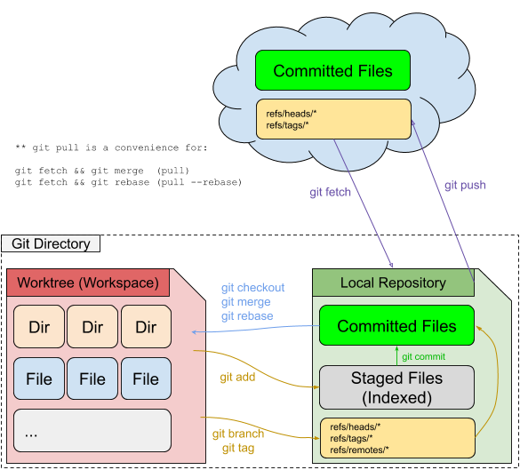

Working with remotes
====================

Topics:

* Git Workflows

  * Email model (Linux Kernel)
  * Pull Request model (GitHub / BitBucket)
  * Patchset model (Gerrit)

* git format-patch
* git am
* git fetch
* git pull
* git push
* Resolving merge conflicts

   Remotes: Fetch & Pull

git fetch
^^^^^^^^^

When should you fetch?

Before starting work & before pushing work to a remote.

git push
^^^^^^^^

When should you push?

Think of pushing as hitting ctrl+s in your editor. Always save your work.
